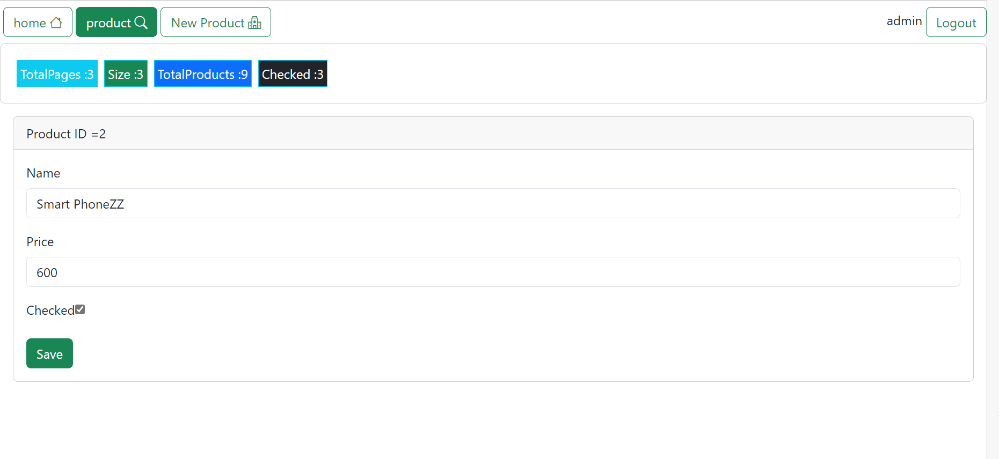

# ExempleApp

This project was generated with [Angular CLI](https://github.com/angular/angular-cli) version 16.1.4.

## Development server

Run `ng serve` for a dev server. Navigate to `http://localhost:4200/`. The application will automatically reload if you change any of the source files.

## Code scaffolding

Run `ng generate component component-name` to generate a new component. You can also use `ng generate directive|pipe|service|class|guard|interface|enum|module`.

<h3>scren des interfaces de l'application</h3>

<h5>add new produit</h5>

<h5>listes des produits</h5>

<h5>edit produit</h5>

<h5>action non authorizer</h5>

